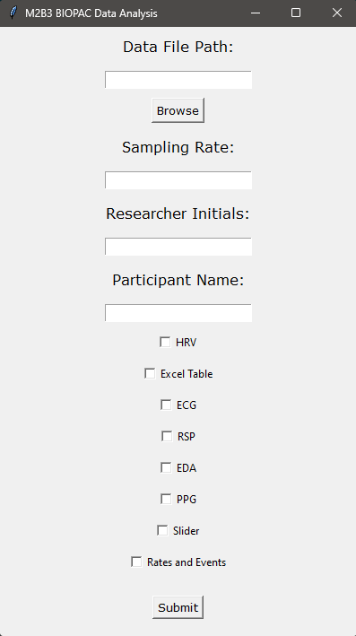

m2b3_absorption
==============================

BIOPAC system data analysis code

Project Organization
------------

    ├── LICENSE
    ├── Makefile           <- Makefile with commands like `make data` or `make train`
    ├── assets             <- Assets used in the README, such as images showcasing the GUI interface.
    ├── README.md          <- The top-level README for developers using this project.
    ├── data
    │   ├── external       <- Data from third party sources.
    │   ├── interim        <- Processed signals and event markers via NeuroKit, saved as CSV files.
    │   ├── processed      <- The final, canonical data sets for modeling.
    │   └── raw            <- The original, immutable data dump.
    │
    ├── docs               <- A default Sphinx project; see sphinx-doc.org for details
    │
    ├── references         <- Data dictionaries, manuals, and all other explanatory materials.
    │
    ├── reports            <- Generated analysis as HTML, PDF, LaTeX, etc.
    │   └── figures        <- Generated graphics and figures to be used in reporting
    │
    ├── requirements.txt   <- The requirements file for reproducing the analysis environment, e.g.
    │                         generated with `pip freeze > requirements.txt`
    │
    ├── setup.py           <- makes project pip installable (pip install -e .) so src can be imported
    ├── src                <- Source code for use in this project.
    │   ├── __init__.py    <- Makes src a Python module
    │   │
    │   ├── read           <- Script to import and read data
    │   │   └── make_dataset.py
    │   │
    │   ├── features       <- Script to turn raw data into processed physiological signals and event markers
    │   │   │                 via NeuroKit, saving them as CSV files.
    │   │   └── build_features.py
    │   │
    │   ├── visualization  <- Scripts to create exploratory and results oriented visualizations
    │   │   └── visualize.py
    │   │    
    │   ├── gui           <- Script containing the gui code for user input and data selection
    │   │   └── run_gui.py
    │   │    
    │   └── main.py        <- Script for running the codes 
    │
    └── 

--------

<small>Project based on the <a target="_blank" href="https://drivendata.github.io/cookiecutter-data-science/">cookiecutter data science project template</a>. #cookiecutterdatascience</small>

